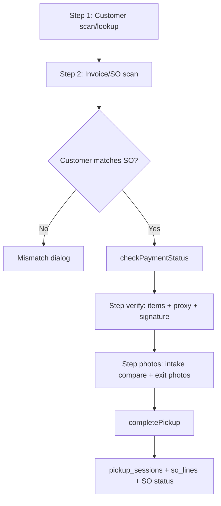

# Q-006 — Map Pickup Station + QBO bypass workflow

**Status:** complete
**Task source:** TASK-QUEUE.md
**Generated:** 2026-06-28
**Depends on:** Q-001 (intake / photo sources), Q-005 (QBO payment check)
**Inputs read:**
- `apps/rs/src/pages/sales/PickupStationPage.tsx` (2519 lines — primary operator UI)
- `apps/rs/src/components/sales/PaymentBypassDialog.tsx`
- `apps/rs/src/components/sales/PickupQRCode.tsx`
- `apps/rs/src/pages/public/PickupVerificationPage.tsx` (client self-confirm path)
- `apps/rs/src/hooks/useCustodyLog.ts` (pickup_sessions in custody timeline)
- `apps/rs/supabase/functions/qbo-invoice-status/index.ts`
- `apps/rs/supabase/functions/compare-signatures/index.ts` (referenced)
- `apps/rs/supabase/functions/send-pickup-email/index.ts` (resend code)
- `apps/rs/supabase/functions/encrypt-proxy-id/index.ts` (proxy ID upload)
- `apps/rs/supabase/migrations/20260204020641_*.sql` — `pickup_sessions`, `so_lines.picked_up_*`
- `apps/rs/supabase/migrations/20260206205453_*.sql` — `payment_bypass_log`
- `apps/rs/supabase/migrations/20260208073252_*.sql` — `pickup_photo_urls`
- `apps/rs/supabase/migrations/20260204023224_*.sql` — proxy pickup fields
- `apps/rs/supabase/migrations/20260207111235_*.sql` — signature columns
- `documentation/RS_CONTEXT_DOSSIER.md` §4.5, §4.6
- `documentation/discovery/Q-005-qbo-sync-paths.md`
- **Skill:** `mapping-legacy-workflows`

---

## 1. Workflow name and purpose

**Pickup Station** — Dual-scan, in-person release workflow. Staff verify the customer identity, verify the sales order / invoice, confirm QBO payment (or bypass with audit), visually compare intake photos to the physical item, capture exit photos and optional signature, then mark lines picked up and release custody.

Route: `/sales/pickup-station` → `PickupStationPage.tsx`

Related public surfaces (out of scope for operator flow but linked):
- `/pickup?code=` — `PickupVerificationPage.tsx` (client can self-confirm pickup with auth)
- `/pickup-pass` — `ClientPickupPassPage.tsx` (pickup pass display)

---

## 2. Trigger

| Trigger | Who | Entry |
|---------|-----|-------|
| Customer walks in for pickup | Front desk staff | Opens Pickup Station |
| USB barcode scanner (customer QR) | Staff | Step 1 scan field |
| USB scanner (invoice / pickup QR) | Staff | Step 2 scan field |
| Manual SO# / EST# entry | Staff | Steps 1–2 (lookup fallback) |
| Recent orders list tap | Staff | Step 1 shortcut |
| Admin "Mark Picked Up" shortcut | Admin only | Step 2 — skips photos/payment UI |
| Client lacks pickup code | Staff | "Resend Code" → `send-pickup-email` |

---

## 3. Actors

| Actor | Role |
|-------|------|
| Staff (pickup station) | Runs dual-scan flow, captures photos, completes release |
| Customer | Presents QR / pickup code; may sign |
| Proxy picker | Optional third party — requires name + government ID photo |
| Admin | Can use "Mark Picked Up" shortcut; bypass at ship station is tighter |
| `qbo-invoice-status` edge function | Live QBO balance check when local `is_paid` unknown |
| `qbo-payment-webhook` (indirect) | Pre-populates `sales_orders.is_paid` before staff arrive |
| `compare-signatures` edge function | AI signature match drop-off vs pickup |
| `payment_bypass_log` | Permanent audit of payment overrides |
| `pickup_sessions` | Per-pickup session record (custody log source) |
| `useCustodyLog` hook | Aggregates pickups into daily chain-of-custody view |

---

## 4. Inputs

### Step 1 — Customer identification

| Input | Format | Lookup |
|-------|--------|--------|
| Customer QR | Newline-delimited `NAME:`, `EMAIL:`, `PHONE:` | `customers` by email or name |
| SO# | `SO-500004`, `500004` | `sales_orders` → customer |
| EST# | `EST-12345`, `E12345` | `estimates` → customer |

### Step 2 — Order / invoice identification

| Input | Format | Lookup |
|-------|--------|--------|
| Pickup verification QR | URL with `?code=` or 8-char hex code | `pickup_verification_codes` → `sales_orders` |
| SO# / EST# | Same as step 1 | Direct SO load or estimate → SO |

### Verify step

| Input | Purpose |
|-------|---------|
| `pickupItems` (ItemSelector) | What physical items are leaving (e.g. "Complete watch") |
| `selectedLines` | Partial pickup quantities per `so_lines` |
| Proxy toggle + name + ID photo | Third-party pickup |
| Pickup signature (optional) | Identity verification |
| Notes | Free text appended to session |

### Photos step

| Input | Purpose |
|-------|---------|
| `itemVerified` checkbox | Staff attestation item matches intake photos |
| Exit photos (camera / upload) | Stored to `shipment-photos` bucket |

### Payment gate

| Input | Source |
|-------|--------|
| `sales_orders.is_paid`, `balance_due` | Local DB (webhook-updated) |
| QBO invoice balance | `qbo-invoice-status` when local state inconclusive |
| Bypass amount | Staff-entered in `PaymentBypassDialog` |

---

## 5. Steps (end-to-end flow)

### Scan steps (UI state machine)

`ScanStep`: `customer` → `invoice` → `verify` → `photos` → `complete`

### Step 1 — Customer (`handleStep1Input` L415–433, `processCustomerScan` L464–516)

1. Detect QR (contains `NAME:` / `EMAIL:` / newlines) vs SO#/EST# lookup
2. QR: parse fields, query `customers` by email (preferred) or name
3. Lookup: resolve SO or estimate → customer
4. Set `customerData`; advance to `invoice` step

### Step 2 — Invoice (`handleStep2Input` L436–462)

1. Detect pickup QR (`code=`, URL, 8-char hex, 20+ alphanumeric) vs SO#/EST#
2. **QR path** (`processInvoiceScan` L876–1002):
   - Parse `verification_code` from URL or raw scan
   - Join `pickup_verification_codes` → `sales_orders` + lines + customer
   - **Customer match check** (L947–950): mismatch → `showMismatchDialog`
   - Set `invoiceData`; advance to `verify`
3. **Lookup path** (`processOrderLookup` L623–749):
   - Load SO by number; reject outbound-shipping SOs → "use Ship Station"
   - Same customer match + payment check
4. Call `checkPaymentStatus` if `qbo_invoice_id` present; else assume paid (L731–746, L990–996)

### Payment check (`checkPaymentStatus` L1004–1085)

**Decision order (how "known paid" works):**

| Order | Condition | Action | Lines |
|-------|-----------|--------|-------|
| 1 | `sales_orders.is_paid === true` | Trust local DB; `isPaid: true`, skip QBO | L1015–1024 |
| 2 | `balance_due > 0` | Block; show balance; skip QBO | L1027–1037 |
| 3 | Else | Invoke `qbo-invoice-status` with `{ qboInvoiceId }` | L1041–1044 |
| 4 | QBO `balance === 0` | Paid | L1062–1067 |
| 5 | QBO `balance > 0` | Unpaid + warning toast | L1069–1071 |
| 6 | Error / reconnect | Block pickup (`balance: -1`) | L1046–1081 |

**QBO bypass path** — does NOT call QBO; sets client flag only after audit insert:

| Step | File | Lines | Behavior |
|------|------|-------|----------|
| Staff clicks "Bypass Payment" | `PickupStationPage.tsx` | L1845–1853, L2266–2274 | `setShowBypassDialog(true)` |
| Dialog confirms | `PaymentBypassDialog.tsx` | L54–106 | Insert `payment_bypass_log`; invoke `send-security-alert` |
| Callback | `PickupStationPage.tsx` | L1147–1149 | `setIsPaymentBypassed(true)` |
| Release gate | `PickupStationPage.tsx` | L1222–1226, L2292–2296 | `completePickup` allowed if `isPaid \|\| isPaymentBypassed` |

**Pickup vs Ship bypass permission** (`PaymentBypassDialog.tsx` L48–49):
- `pickup_station`: **any authenticated user** can bypass
- `ship_station`: admin, manager, or `canBypassPayment` only

### Verify step (L1944–2306)

1. Display customer + order + payment cards
2. `PickupQRCode` — show/regenerate verification QR (`generate_pickup_code` RPC)
3. `ItemSelector` — physical items being released
4. Optional proxy pickup: name + encrypted proxy ID upload (`encrypt-proxy-id`)
5. Optional `SignaturePad` → `signatures` bucket → `compare-signatures` vs `package_scan_logs.dropoff_signature_url`
6. Payment block UI if unpaid and not bypassed
7. "Next: Take Photos" — gated on paid/bypass + proxy requirements

### Photos step (L2309–2454)

**Intake photo comparison (read-only reference):**

1. Query `sales_orders.estimate_id` (L196–200)
2. Load `package_scan_logs.photo_urls` where `matched_estimate_id = estimate_id` (L205–210)
3. Resolve public URLs from `shipment-photos` storage bucket (L216–219)
4. Display grid labeled "Intake Photos (Reference)" (L2322–2341)
5. If none: warning banner — "No intake photos on file" (L2343–2350)

**⚠️ Gap:** Drop-off intakes (Q-001 Path B) may not write `package_scan_logs` — pickup comparison only covers **package receive** path photos.

**Exit photos:**

1. `CameraDialog` or file upload → `pickupPhotos[]` state
2. `uploadPickupPhotos` (L1468–1484): upload to `shipment-photos/{salesOrderId}/...`
3. Staff must check `itemVerified` (L2418–2433) — manual attestation, no automated image diff
4. `completePickup` (L1219–1341)

### Complete pickup writes

| Target | Fields | Lines |
|--------|--------|-------|
| `pickup_sessions` | customer, SO, QBO balance snapshot, proxy, signature match, `pickup_photo_urls`, `completed_at` | L1262–1291 |
| `so_lines` | `picked_up_qty`, `picked_up_at`, `picked_up_by` per selected line | L1296–1310 |
| `pickup_verification_codes` | `picked_up_at` | L1314–1317 |
| `sales_orders` | `status: 'picked_up'`, `picked_up_at` if all lines complete | L1326–1330 |

**Note:** Normal `completePickup` does **not** insert `audit_log`. Only admin shortcut does (L1391–1398).

### Admin shortcut (`handleAdminMarkPickedUp` L1344–1408)

Skips photos, signature, item verification. Writes minimal `pickup_sessions`, updates all lines fully picked up, `audit_log` action `admin_mark_picked_up`.

---

## 6. Outputs

| Output | Destination |
|--------|-------------|
| `pickup_sessions` row | Custody timeline (`useCustodyLog`), direction `out`, station `Pickup Station` |
| `pickup_photo_urls[]` | Exit photos on session + custody log |
| `so_lines.picked_up_qty` | Partial pickup tracking |
| `sales_orders.status = picked_up` | When all lines picked up |
| `payment_bypass_log` row | If bypass used — visible in custody log as concern |
| `send-security-alert` | SMS/email to admin on bypass |
| Proxy ID | Encrypted in `proxy-ids` bucket via edge function |

**Not updated on pickup:**
- `client_property.custody_status` — no release write found
- `shared.audit_log` (D-019 target) — only admin shortcut uses legacy `audit_log`

---

## 7. Cross-app touches

| Touch | Notes |
|-------|-------|
| QBO | `qbo-invoice-status` live balance; `sales_orders.qbo_invoice_id` link |
| Intake (Q-001) | Intake photos from `package_scan_logs` only |
| Ship Station | Shared `PaymentBypassDialog`; outbound-shipping SOs redirected |
| RolliConnect | Customer master read-only |
| Email | `send-pickup-email`, `PickupQRCode` email send |
| Custody log UI | `useCustodyLog` reads `pickup_sessions` + `payment_bypass_log` |

---

## 8. Edge cases

| Edge case | Behavior |
|-----------|----------|
| Customer ≠ invoice owner | Mismatch dialog; can "Continue Anyway" |
| SO has outbound shipping parts | Blocked — "use Ship Station" (L686–693) |
| No QBO invoice on SO | Assumes paid (L731–746) — **risk if never invoiced** |
| QBO auth expired | `requiresReconnect`; pickup blocked |
| Partial pickup | Updates `picked_up_qty` per line; SO stays non-`picked_up` until all lines done |
| Proxy pickup | Requires name + ID photo before advancing |
| No intake photos | Warning only; staff checkbox still required |
| Payment just received in QBO | Staff uses "Refresh Payment" (L1829–1843) |
| Client self-confirm | `PickupVerificationPage` updates code + SO status without station photos |

---

## 9. Workarounds observed

| Workaround | Where | Why |
|------------|-------|-----|
| Local `is_paid` trusted before QBO API | `checkPaymentStatus` L1015–1024 | QBO payment registration latency |
| Payment bypass (all staff at pickup) | `PaymentBypassDialog` L49 | Operational need when customer paid but QBO lags |
| Assume paid when no `qbo_invoice_id` | L731–746, L990–996 | Non-QBO orders skip payment gate |
| Manual `itemVerified` checkbox | Photos step L2418–2433 | No automated photo diff — staff eyeball compare |
| Intake photos only from package receive | L204–210 | Drop-off path may lack reference photos |
| Admin "Mark Picked Up" | L1344–1408 | Bypass full flow for corrections |
| Signature AI compare optional | Verify step | Drop-off signature may not exist |

---

## 10. Open questions

### Q-006-A: Should drop-off intake photos feed pickup comparison?

**Type:** scope
**Question:** Should `ClientWatchEntryPage` intake photos (R2 / `client-photos`) also appear in Pickup Station reference grid?
**What I observed:** Only `package_scan_logs.photo_urls` queried.
**Default:** Rebuild should unify intake photo source per D-019 / W-33.

### Q-006-B: Should `completePickup` write custody release on `client_property`?

**Type:** business truth
**Question:** Does physical release require updating `custody_status` on the watch record?
**What I observed:** Only `sales_orders` + `pickup_sessions` updated.
**Default:** Chain-of-custody rebuild (D-015) should link pickup session → client asset release.

### Q-006-C: Why is pickup bypass open to all staff but ship bypass is restricted?

**Type:** business truth
**Question:** Intentional policy difference?
**What I observed:** `PaymentBypassDialog` L48–49 explicit branch.
**Default:** Document as intentional for in-person counter; revisit for rebuild RBAC.

---

## 11. Schema summary

### `pickup_sessions`

| Column | Purpose |
|--------|---------|
| `customer_id`, `customer_scanned_at` | Step 1 verification |
| `sales_order_id`, `verification_code`, `invoice_scanned_at` | Step 2 |
| `qbo_invoice_id`, `qbo_balance`, `payment_verified_at`, `is_paid` | Payment snapshot |
| `status`, `completed_at`, `notes` | Session lifecycle |
| `is_proxy_pickup`, `proxy_name`, `proxy_id_photo_url` | Proxy pickup |
| `pickup_signature_url`, `signature_match_score`, `signature_match_result` | Signature compare |
| `pickup_photo_urls` | Exit photos (text[] URLs) |

### `pickup_verification_codes`

Links SO to `verification_code`; QR encodes `/pickup?code={code}`. Created by `PickupQRCode` via `generate_pickup_code()` RPC.

### `payment_bypass_log`

| Column | Purpose |
|--------|---------|
| `sales_order_id`, `so_number`, `customer_id`, `customer_name` | Order context |
| `bypass_amount`, `balance_due`, `total_amount` | Financial snapshot |
| `station` | `'pickup_station'` \| `'ship_station'` |
| `bypassed_by`, `bypassed_by_email` | Staff attribution |
| `created_at` | Audit timestamp |

### `so_lines` pickup columns

`picked_up_qty`, `picked_up_at`, `picked_up_by` — partial pickup support.

---

## 12. Audit log writes

| Event | Table | When |
|-------|-------|------|
| Payment bypass | `payment_bypass_log` | `PaymentBypassDialog.handleBypass` L66–79 |
| Security alert | edge fn `send-security-alert` | Same handler L87–94 |
| Admin mark picked up | `audit_log` (`admin_mark_picked_up`) | `handleAdminMarkPickedUp` L1391–1398 |
| Normal pickup complete | `pickup_sessions` only | `completePickup` L1262–1291 |
| Custody timeline | `useCustodyLog` aggregation | Reads `pickup_sessions` + bypasses |

**Gap for D-015 / D-019:** No unified `shared.audit_log` on standard pickup complete. Rebuild should treat `pickup_sessions.id` as custody event ID and link to station + camera metadata.

---

## 13. D-015 integration points — IP cam / Nest snapshot (W-41)

Future auto-snapshot should hook **without rebuilding** the scan flow. Recommended seam points:

| Hook point | File:line | Event | Suggested payload |
|------------|-----------|-------|-------------------|
| **H1 — Invoice verified** | `PickupStationPage.tsx` ~L983–984 | SO loaded + customer match OK | `{ station_id: 'pickup_station', event: 'invoice_scanned', sales_order_id, customer_id, verification_code }` |
| **H2 — Payment cleared** | ~L1017 or L1062 | `is_paid` confirmed (DB or QBO) | `{ event: 'payment_verified', sales_order_id, source: 'local' \| 'qbo' }` |
| **H3 — Payment bypass** | `PaymentBypassDialog.tsx` L66–79 | Bypass logged | `{ event: 'payment_bypass', sales_order_id, bypass_log_id }` |
| **H4 — Pre-release photos** | `completePickup` ~L1258 (before upload) | Staff initiated complete | `{ event: 'release_imminent', sales_order_id }` — **best Nest trigger per W-41** |
| **H5 — Pickup completed** | `completePickup` ~L1333 | Custody release committed | `{ event: 'pickup_complete', pickup_session_id, photo_urls }` |
| **H6 — Proxy ID captured** | proxy upload ~L1250–1256 | Third-party pickup | `{ event: 'proxy_id_captured', sales_order_id }` |

**Implementation pattern (rebuild):**
- Add thin `record-station-event` edge function or extend `pickup_sessions` with `station_camera_snapshot_urls[]`
- Nest / IP cam listens on H4 (QR scan complete + payment OK) — matches W-41: "After QR scan at pickup, auto-snap photos of customer leaving"
- Tag all events with `station_id: 'pickup_station'` for D-015 queryable security timeline
- Do **not** block pickup on camera failure — append-only audit per D-015

**Existing photo infrastructure to reuse:**
- Exit photos → `shipment-photos` bucket (same as intake package photos)
- Proxy ID → `proxy-ids` bucket (private)
- Signatures → `signatures` bucket

---

## 14. Comparison to workflow docs

| Source | Claim | Code finding |
|--------|-------|--------------|
| RS_CONTEXT_DOSSIER §4.6 | Pickup verification + sessions + proxy security | **Confirmed** |
| Q-005 | `qbo-invoice-status` at pickup gate | **Confirmed** L1041–1044 |
| D-015 / W-49 | Chain of custody / camera audit | **Partial** — `pickup_sessions` + custody log exist; no camera auto-snap |
| W-41 | Nest snapshot after QR scan | **Not implemented** — hook points identified in §13 |
| Michael workflow §3 | Not found in repo at discovery time | Operator flow matches dual-scan + payment check pattern |

---

## 15. What "done" means (acceptance criteria check)

- ✅ Step-by-step flow QR scan → completion documented
- ✅ Payment check: local `is_paid` first, then `qbo-invoice-status`; bypass path with file + line numbers
- ✅ "Known paid" decision logic: `is_paid === true` OR QBO `balance === 0` OR bypass flag OR no QBO invoice assumed paid
- ✅ Photo comparison: intake grid from `package_scan_logs`; exit photos to `shipment-photos`; manual checkbox
- ✅ Audit writes: `payment_bypass_log`, `pickup_sessions`, admin `audit_log`
- ✅ IP cam / Nest hook points for D-015 identified without redesigning flow

---

_End of discovery. Q-006 complete._
